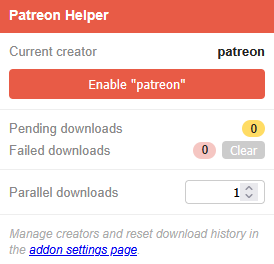
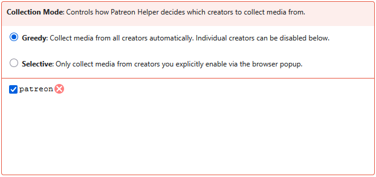
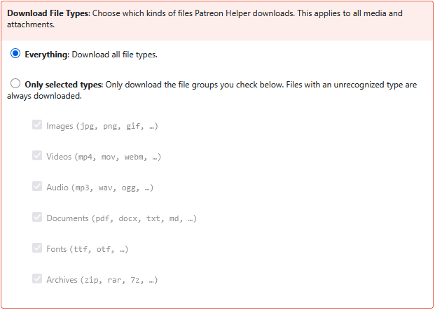
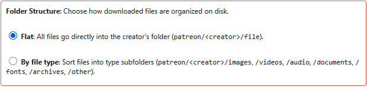

# Patreon Helper
Automatically downloads media in the background as you browse Patreon — images,
videos, audio, documents, and attachments — so you don't have to save each file
by hand. Downloads are de-duplicated and sorted by creator.

## Requirements
* Firefox 57+

## Installation
Go to https://addons.mozilla.org/firefox/addon/patreon-helper/ and click "Add to Firefox".

## Usage
Simply browse Patreon as you usually would. Patreon Helper scans both individual
creator pages and your home feed, so any media that loads while you browse gets
picked up automatically — there's no need to click a file to open its full version.

Downloads are stored in your Firefox download directory, inside a `patreon`
sub-folder and sorted by creator (`patreon/<creator>/`).

## The Popup
Clicking the toolbar icon opens the popup, which shows what's happening right now:

* **Current creator** — the creator detected on the current page, with a button to
  enable or disable collection for them. On your home feed it shows the active
  collection mode instead.
* **Pending / Failed downloads** — live counters of the download queue. **Clear**
  removes failed entries so they can be collected again from scratch.
* **Parallel downloads** — how many files download at the same time (1–4).
* A link to the full **settings page** for managing creators and history.

## Options
The settings page gives you finer control:

**Collection Mode** — decide which creators to collect from. *Greedy* grabs media
from everyone automatically (you can disable individual creators), while *Selective*
only collects from creators you explicitly enable via the popup.

**Download File Types** — download *everything*, or restrict downloads to selected
file groups (images, videos, audio, documents, fonts, archives).

**Folder Structure** — store everything *flat* under the creator's folder, or sort
files into type subfolders (`patreon/<creator>/images`, `/videos`, `/audio`, …).

## Feedback & Contributions
Feedback welcome at flam@dogpixels.net

You know JavaScript and want to improve this Extension? Pull Requests to this repository are always welcome.

## Disclaimer
This extension and its creator and contributors are not affiliated with Patreon. This tool can break at any time upon a change in Patreon's internal website structure. The download helper will only help you download media you have pledged for through Patreon. It does not enable you to access anything that you aren't supposed to access.